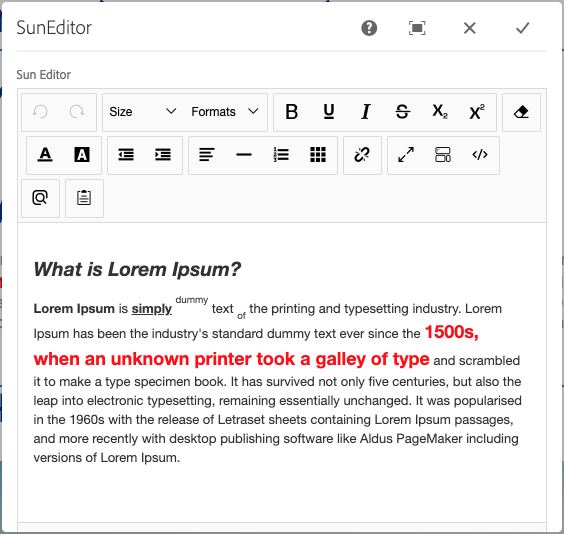

# AEM-SunEditor
Enables using [http://suneditor.com](http://suneditor.com) in AEM dialogs as an RTE replacement.




## Usage

Here is a sample `cq:dialog`: 

```xml
<cq:dialog jcr:primaryType="nt:unstructured"
  sling:resourceType="cq/gui/components/authoring/dialog"
  jcr:title="SunEditor"
  extraClientlibs="[suneditor]">
  <content jcr:primaryType="nt:unstructured"
    sling:resourceType="granite/ui/components/coral/foundation/container">
    <items jcr:primaryType="nt:unstructured">
      <textarea jcr:primaryType="nt:unstructured"
        sling:resourceType="granite/ui/components/coral/foundation/form/textarea"
        fieldLabel="Sun Editor"
        granite:id="suneditor"
        name="./html"
        resize="vertical"
        rows="20"/>
    </items>
  </content>
</cq:dialog>
```

**The important parts are:**

1. on `cq:dialog` node, add `extraClientlibs="[suneditor]"`
2. create a text area field: `sling:resourceType="granite/ui/components/coral/foundation/form/textarea"`
3. set `granite:id="suneditor"` on the text area.
